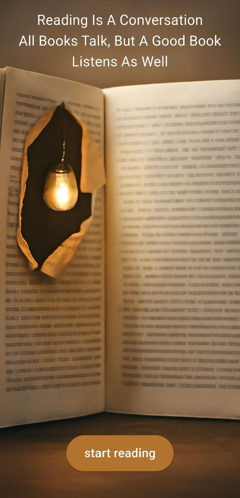
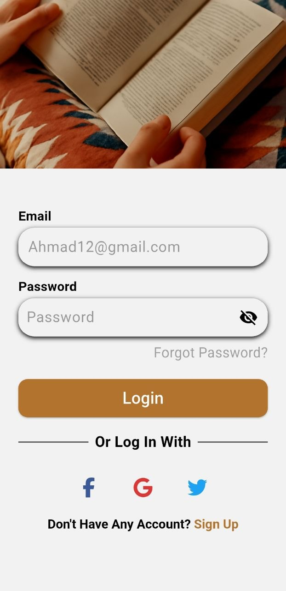
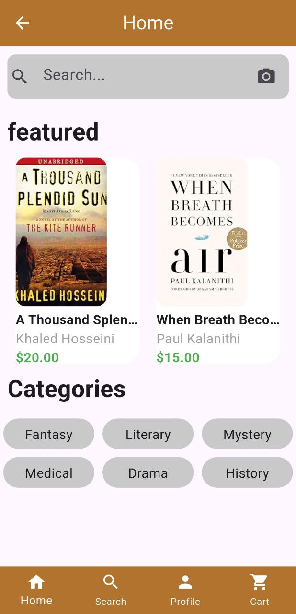
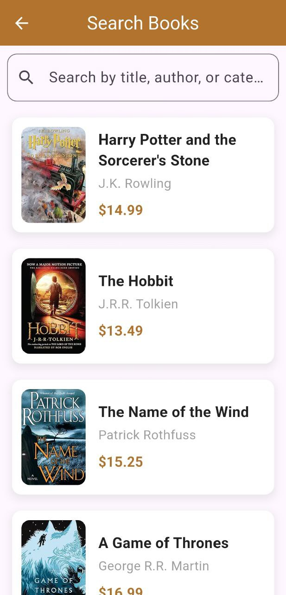
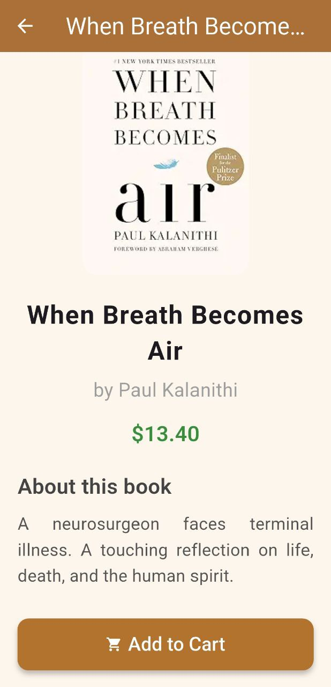

# Flutter BookStore App

A mobile application built using Flutter that allows users to browse and purchase books through a clean and user-friendly interface.

## Features
- Browse available books
- View book details
- Search for books
- User authentication (Sign Up & Login)
- Organized categories and profile page

## Technologies Used
- Flutter
- Dart
- Hive Database

## Project Type
Academic / Practical Project

## Screenshots

### Onboarding & Authentication

### Main App Screens

## Author
Omar Al-Kenji